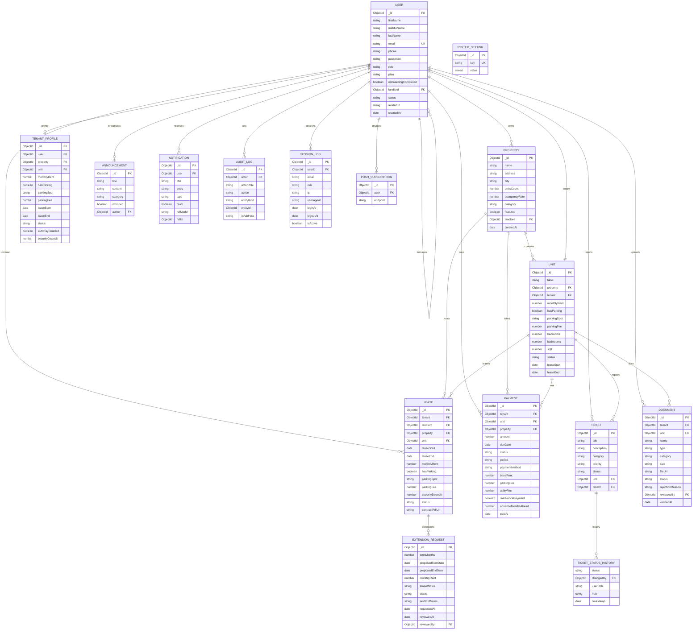

# Entity Relationship Diagram

```mermaid
erDiagram
    USER ||--o{ USER : "manages"
    USER ||--o{ PROPERTY : "owns"
    USER ||--o| TENANT_PROFILE : "profile"
    USER ||--o{ LEASE : "contract"
    USER ||--o{ PAYMENT : "pays"
    USER ||--o{ TICKET : "reports"
    USER ||--o{ DOCUMENT : "uploads"
    USER ||--o{ ANNOUNCEMENT : "broadcasts"
    USER ||--o{ NOTIFICATION : "receives"
    USER ||--o{ AUDIT_LOG : "acts"
    USER ||--o{ SESSION_LOG : "sessions"
    USER ||--o{ PUSH_SUBSCRIPTION : "devices"

    PROPERTY ||--o{ UNIT : "contains"
    PROPERTY ||--o{ LEASE : "hosts"
    PROPERTY ||--o{ PAYMENT : "billed"

    UNIT ||--o| USER : "tenant"
    UNIT ||--o{ LEASE : "leased"
    UNIT ||--o{ PAYMENT : "rent"
    UNIT ||--o{ TICKET : "repairs"
    UNIT ||--o{ DOCUMENT : "docs"

    LEASE ||--o{ EXTENSION_REQUEST : "extensions"
    TICKET ||--o{ TICKET_STATUS_HISTORY : "history"

    USER {
        ObjectId _id PK
        string firstName
        string middleName
        string lastName
        string email UK
        string phone
        string password
        string role
        string plan
        boolean onboardingCompleted
        ObjectId landlord FK
        string status
        string avatarUrl
        date createdAt
    }

    PROPERTY {
        ObjectId _id PK
        string name
        string address
        string city
        number unitsCount
        number occupancyRate
        string category
        boolean featured
        ObjectId landlord FK
        date createdAt
    }

    UNIT {
        ObjectId _id PK
        string label
        ObjectId property FK
        ObjectId tenant FK
        number monthlyRent
        boolean hasParking
        string parkingSpot
        number parkingFee
        number bedrooms
        number bathrooms
        number sqft
        string status
        date leaseStart
        date leaseEnd
    }

    TENANT_PROFILE {
        ObjectId _id PK
        ObjectId user FK
        ObjectId property FK
        ObjectId unit FK
        number monthlyRent
        boolean hasParking
        string parkingSpot
        number parkingFee
        date leaseStart
        date leaseEnd
        string status
        boolean autoPayEnabled
        number securityDeposit
    }

    LEASE {
        ObjectId _id PK
        ObjectId tenant FK
        ObjectId landlord FK
        ObjectId property FK
        ObjectId unit FK
        date leaseStart
        date leaseEnd
        number monthlyRent
        boolean hasParking
        string parkingSpot
        number parkingFee
        number securityDeposit
        string status
        string contractPdfUrl
    }

    EXTENSION_REQUEST {
        ObjectId _id PK
        number termMonths
        date proposedStartDate
        date proposedEndDate
        number monthlyRent
        string tenantNotes
        string status
        string landlordNotes
        date requestedAt
        date reviewedAt
        ObjectId reviewedBy FK
    }

    PAYMENT {
        ObjectId _id PK
        ObjectId tenant FK
        ObjectId unit FK
        ObjectId property FK
        number amount
        date dueDate
        string status
        string period
        string paymentMethod
        number baseRent
        number parkingFee
        number utilityFee
        boolean isAdvancePayment
        number advanceMonthsAhead
        date paidAt
    }

    TICKET {
        ObjectId _id PK
        string title
        string description
        string category
        string priority
        string status
        ObjectId unit FK
        ObjectId tenant FK
    }

    TICKET_STATUS_HISTORY {
        string status
        ObjectId changedBy FK
        string userRole
        string note
        date timestamp
    }

    DOCUMENT {
        ObjectId _id PK
        ObjectId tenant FK
        ObjectId unit FK
        string name
        string type
        string category
        string size
        string fileUrl
        string status
        string rejectionReason
        ObjectId reviewedBy FK
        date verifiedAt
    }

    ANNOUNCEMENT {
        ObjectId _id PK
        string title
        string content
        string category
        boolean isPinned
        ObjectId author FK
    }

    NOTIFICATION {
        ObjectId _id PK
        ObjectId user FK
        string title
        string body
        string type
        boolean read
        string refModel
        ObjectId refId
    }

    AUDIT_LOG {
        ObjectId _id PK
        ObjectId actor FK
        string actorRole
        string action
        string entityKind
        ObjectId entityId
        string ipAddress
    }

    SESSION_LOG {
        ObjectId _id PK
        ObjectId userId FK
        string email
        string role
        string ip
        string userAgent
        date loginAt
        date logoutAt
        boolean isActive
    }

    PUSH_SUBSCRIPTION {
        ObjectId _id PK
        ObjectId user FK
        string endpoint
    }

    SYSTEM_SETTING {
        ObjectId _id PK
        string key UK
        mixed value
    }
```
