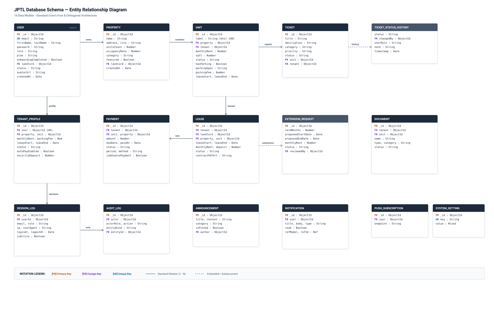
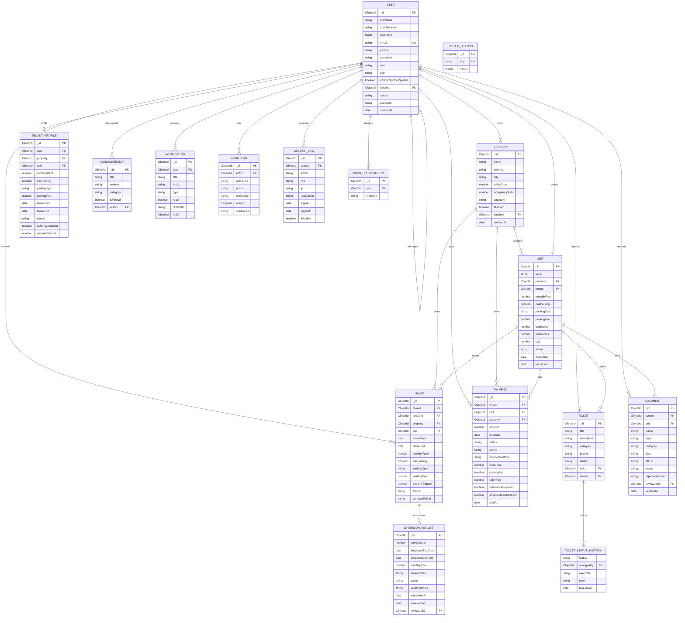

# JPTL Property Management Platform — Entity Relationship Diagram (ERD)

This document contains the Entity Relationship Diagram (ERD) and Schema Specifications for all 14 Mongoose models in `apps/server/src/shared/models`.

---

## 1. Visual Entity Relationship Diagram

> **Tip**: You can also open **[erd.html](./erd.html)** in any browser for an interactive canvas with pan & zoom.

Click to view raw Mermaid source code

---

## 2. Model Dictionary

### 1. `User` (`user.model.js`)
* **Collection:** `users`
* **Purpose:** Core identity model supporting multi-role authentication (Tenant, Landlord, Superadmin).
* **Key Fields:**
  * `email` (String, unique): Primary login identifier.
  * `role` (Enum): `'tenant'`, `'landlord'`, `'superadmin'`.
  * `landlord` (ObjectId -> User): Self-referencing link establishing tenant-landlord association.
  * `plan` (Enum): `'starter'`, `'pro'`, `'enterprise'`.
  * `status` (Enum): `'active'`, `'suspended'`.

### 2. `Property` (`property.model.js`)
* **Collection:** `properties`
* **Purpose:** Real estate developments or buildings owned by a landlord.
* **Key Fields:**
  * `landlord` (ObjectId -> User, required): The owning landlord.
  * `name`, `address`, `city` (Strings): Physical details.
  * `category` (Enum): `'Luxury'`, `'Studio'`, `'Penthouse'`, `'Residential'`, `'Commercial'`.
  * `accessCodes` (Object): Embedded Wi-Fi and gate passcodes.

### 3. `Unit` (`unit.model.js`)
* **Collection:** `units`
* **Purpose:** Individual rentable units within a property.
* **Key Fields:**
  * `property` (ObjectId -> Property, required).
  * `tenant` (ObjectId -> User, nullable): Active occupying tenant.
  * `status` (Enum): `'occupied'`, `'vacant'`, `'maintenance'`.
  * `monthlyRent`, `parkingFee`, `sqft` (Numbers).
  * `leaseStart`, `leaseEnd` (Dates).

### 4. `TenantProfile` (`tenantProfile.model.js`)
* **Collection:** `tenantprofiles`
* **Purpose:** Extended tenant state, payment methods, vehicle registrations, and lease terms.
* **Key Fields:**
  * `user` (ObjectId -> User, unique).
  * `property`, `unit` (ObjectIds, nullable).
  * `vehicles` (Array of subdocuments): `{ model, plate }`.
  * `paymentMethods` (Array of subdocuments): Tokenized credit cards and ACH profiles.

### 5. `Lease` (`lease.model.js`)
* **Collection:** `leases`
* **Purpose:** Formal lease contractual terms, covenants, and extension negotiation lifecycle.
* **Key Fields:**
  * `tenant`, `landlord`, `property`, `unit` (ObjectIds).
  * `leaseStart`, `leaseEnd` (Dates).
  * `status` (Enum): `'active'`, `'renewal_pending'`, `'renewal_approved'`, `'renewal_rejected'`, `'ended'`.
  * `extensionRequests` (Array of subdocuments): Extension duration, requested rent, dates, approval status, and reviewer notes.

### 6. `Payment` (`payment.model.js`)
* **Collection:** `payments`
* **Purpose:** Rent invoices, utility billings, and advance payment transactions.
* **Key Fields:**
  * `tenant`, `unit`, `property` (ObjectIds).
  * `amount`, `dueDate`, `paidAt`.
  * `status` (Enum): `'pending'`, `'paid'`, `'overdue'`, `'failed'`.
  * `isAdvancePayment` (Boolean), `advanceMonthsAhead` (Number).

### 7. `Ticket` (`ticket.model.js`)
* **Collection:** `tickets`
* **Purpose:** Tenant maintenance requests with dispatch workflow.
* **Key Fields:**
  * `tenant`, `unit` (ObjectIds).
  * `category` (Enum): `'HVAC'`, `'Plumbing'`, `'Electrical'`, `'Appliance'`, `'General'`, `'Structural'`, `'Pest'`, `'Other'`.
  * `priority` (Enum): `'low'`, `'medium'`, `'high'`, `'emergency'`.
  * `status` (Enum): `'submitted'`, `'acknowledged'`, `'in_progress'`, `'resolved'`, `'rejected'`, `'closed'`, `'cancelled'`.
  * `assignedTechnician` (Embedded Object).
  * `statusHistory` (Array of subdocuments).

### 8. `Document` (`document.model.js`)
* **Collection:** `documents`
* **Purpose:** File uploads for identity verification and signed leases.
* **Key Fields:**
  * `tenant`, `unit` (ObjectIds).
  * `category` (Enum): `'lease'`, `'upload'`, `'receipt'`.
  * `status` (Enum): `'Pending Review'`, `'Verified'`, `'Rejected'`.
  * `reviewedBy` (ObjectId -> User, nullable).

### 9. `Announcement` (`announcements.model.js`)
* **Collection:** `announcements`
* **Purpose:** Broadcast notices published by landlords or admins.
* **Key Fields:**
  * `author` (ObjectId -> User).
  * `category` (Enum): `'System'`, `'Maintenance'`, `'Policy'`, `'General'`.
  * `isPinned` (Boolean).

### 10. `Notification` (`notification.model.js`)
* **Collection:** `notifications`
* **Purpose:** In-app alert records dispatched to specific users.
* **Key Fields:**
  * `user` (ObjectId -> User).
  * `type` (Enum): `'maintenance'`, `'announcement'`, `'payment'`, `'lease'`, `'system'`.
  * `refModel` / `refId`: Polymorphic reference to source document.

### 11. `AuditLog` (`auditLog.model.js`)
* **Collection:** `auditlogs`
* **Purpose:** System-wide compliance and security audit trails.
* **Key Fields:**
  * `actor` (ObjectId -> User), `actorRole`, `action`.
  * `entityKind` (Enum), `entityId` (ObjectId).
  * `ipAddress`.

### 12. `SessionLog` (`sessionLog.model.js`)
* **Collection:** `sessionlogs`
* **Purpose:** User authentication sessions and live monitor.
* **Key Fields:**
  * `userId` (ObjectId -> User), `email`, `role`, `ip`, `userAgent`.
  * `loginAt`, `logoutAt`, `isActive`.

### 13. `PushSubscription` (`pushSubscription.model.js`)
* **Collection:** `pushsubscriptions`
* **Purpose:** Web Push API browser subscription tokens per device.

### 14. `SystemSetting` (`systemSetting.model.js`)
* **Collection:** `systemsettings`
* **Purpose:** Dynamic system key-value storage (maintenance mode, platform flags).
